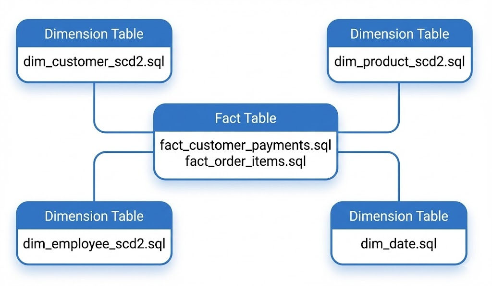

# Data Governance Platform

> **Enterprise-Grade Data Platform** with Medallion Architecture, SCD Type 2 History Tracking, Automated Data Quality Testing, and Data Cataloging

[](https://airflow.apache.org/)
[](https://www.getdbt.com/)
[](https://www.snowflake.com/)
[](https://open-metadata.org/)
[](https://www.docker.com/)

---

## 📋 Table of Contents

- [Overview](#overview)
- [Architecture](#architecture)
- [Technology Stack](#technology-stack)
- [Key Features](#key-features)
- [Project Structure](#project-structure)
- [Getting Started](#getting-started)
- [Data Pipeline](#data-pipeline)
- [Data Models](#data-models)
- [Data Quality](#data-quality)
- [Data Catalog](#data-catalog)
- [Configuration](#configuration)

---

## Overview

This project is a **complete, production-ready data governance platform** that demonstrates modern data engineering best practices. It transforms raw transactional data from a PostgreSQL source into a governed, documented, and analytics-ready data warehouse using the **Medallion Architecture** pattern.

### Business Problem Solved

Organizations suffer from a **data trust crisis**: inconsistent data definitions, lack of lineage visibility, undocumented transformations, and compliance risks with sensitive data. This platform addresses these challenges by providing:

- **Data Trust**: Every transformation is transparent and auditable
- **Data Quality**: 89+ automated tests validate data on every pipeline run
- **Data Discovery**: Searchable data catalog with full column-level documentation
- **Data Lineage**: Visual tracking from source to analytics layer
- **Compliance**: PII tagging and classification for GDPR/CCPA requirements

### Dataset: Classic Models

The platform uses the **Classic Models** retail sales dataset:

| Entity | Records | Description |
|--------|---------|-------------|
| Customers | 122 | B2B customers across Americas, EMEA, APAC |
| Products | 110 | Scale model vehicles across 7 product lines |
| Orders | 326 | Sales orders with 2,996 line items |
| Employees | 23 | Sales representatives and management |
| Offices | 7 | Global office locations |
| Payments | 273 | Customer payment transactions |

---

## Architecture

### High-Level Architecture

<p align="left">
  
</p>

### Medallion Architecture (Bronze → Silver → Gold)

```
┌─────────────────────────────────────────────────────────────────────────────┐
│                           SNOWFLAKE DATA WAREHOUSE                          │
├─────────────────────────────────────────────────────────────────────────────┤
│                                                                             │
│  🥉 BRONZE LAYER                    🥈 SILVER LAYER                         │
│  ├── CUSTOMERS                      ├── silver_customers                    │
│  ├── EMPLOYEES                      ├── silver_employees                    │
│  ├── OFFICES                        ├── silver_offices                      │
│  ├── ORDERS                         ├── silver_orders                       │
│  ├── ORDER_DETAILS                  ├── silver_order_items                  │
│  ├── PAYMENTS                       ├── silver_payments                     │
│  ├── PRODUCTS                       ├── silver_products                     │
│  └── PRODUCT_LINES                  └── silver_product_lines                │
│                                             │                               │
│                                             ▼                               │
│                                    📸 SNAPSHOTS                             │
│                                    ├── customers_snapshot                   │
│                                    ├── products_snapshot                    │
│                                    └── employees_snapshot                   │
│                                             │                               │
│                                             ▼                               │
│                                    🥇 GOLD LAYER                            │
│                                    ├── dim_customer_scd2                    │
│                                    ├── dim_product_scd2                     │
│                                    ├── dim_employee_scd2                    │
│                                    ├── dim_date                             │
│                                    ├── fact_order_items                     │
│                                    └── fact_customer_payments               │
│                                                                             │
└─────────────────────────────────────────────────────────────────────────────┘
```

### Layer Descriptions

| Layer | Purpose | Example Transformations |
|-------|---------|------------------------|
| **Bronze** | Raw data preservation with audit metadata | Add `_LOADED_AT`, `_SOURCE_TABLE` columns |
| **Silver** | Cleaned, standardized, business-ready data | Text normalization, derived fields (REGION, PROFIT_MARGIN) |
| **Snapshots** | SCD Type 2 history tracking | Capture changes to customers, products, employees |
| **Gold** | Star schema for analytics | Surrogate keys, dimension/fact tables, calculated measures |

---

## Technology Stack

| Component | Technology | Version | Purpose |
|-----------|------------|---------|---------|
| **Orchestration** | Apache Airflow | 3.0.0 | Pipeline scheduling and monitoring |
| **Transformation** | dbt-core | 1.10.16 | SQL-based data transformations |
| **Data Warehouse** | Snowflake | Cloud | Scalable columnar storage |
| **Data Catalog** | OpenMetadata | 1.10.14 | Data discovery and governance |
| **Containerization** | Docker Compose | Latest | Development environment |
| **Source Database** | PostgreSQL | 13 | Source system simulation |
| **Search Backend** | Elasticsearch | 8.11.4 | OpenMetadata search engine |

---

## Key Features

### ✅ Automated ETL Pipeline
- **Airflow DAGs** orchestrate data movement from PostgreSQL to Snowflake
- **Dynamic task mapping** processes all source tables in parallel
- **Idempotent operations** allow safe re-runs without duplicating data

### ✅ Medallion Architecture
- **Bronze**: Raw data with audit metadata (`_LOADED_AT`, `_SOURCE_TABLE`)
- **Silver**: Cleaned data with derived business fields
- **Gold**: Star schema optimized for analytics and BI tools

### ✅ SCD Type 2 History Tracking
- **dbt snapshots** capture every change to key entities
- **Version tracking**: `VALID_FROM`, `VALID_TO`, `IS_CURRENT` columns
- **Full audit trail** for compliance and trend analysis

### ✅ Automated Data Quality (89+ Tests)
- **Built-in dbt Tests (~50+)**: `unique`, `not_null` on all primary keys across Bronze, Silver, Gold, Snapshots
- **Relationship Tests**: Foreign key integrity validation across all layers
- **dbt_utils Package Tests (~6)**: `equal_rowcount`, `accepted_range` for business rules
- **Custom SQL Tests (17)**: Silver layer validation, Gold SCD2 checks, referential integrity

### ✅ Role-Based Access Control (RBAC)
- **OpenMetadata RBAC**: Team-based ownership and access policies
- **PII Classification**: Tagged columns for compliance-driven access control

### ✅ Complete Documentation
- **Column-level descriptions** for every table and column
- **PII tagging** for GDPR/CCPA compliance (`gdpr_personal_data`, `financial`)
- **Ownership metadata**: Data Engineering Team, Analytics Team

### ✅ Data Catalog Integration
- **OpenMetadata** provides searchable data discovery
- **Visual lineage** from source to analytics layer
- **Tag-based classification** for sensitive data

---

## Project Structure

```
Data-Project/
├── airflow/                      # Airflow configuration
│   ├── dags/                     # DAG definitions
│   │   ├── postgres_to_snowflake_bronze.py    # ETL: PostgreSQL → Bronze
│   │   ├── dbt_transformations.py              # dbt: Silver → Gold
│   │   ├── test_postgres_connection.py         # Connection test DAG
│   │   └── test_snowflake_connection.py        # Connection test DAG
│   ├── config/                   # Airflow configuration files
│   ├── Dockerfile                # Custom Airflow image with dbt
│   └── requirements.txt          # Python dependencies
│
├── dbt/                          # dbt project
│   ├── models/
│   │   ├── bronze/               # Source definitions
│   │   │   └── sources.yml       # 8 source tables documented
│   │   ├── silver/               # Cleaned data models
│   │   │   ├── silver_customers.sql
│   │   │   ├── silver_orders.sql
│   │   │   ├── silver_products.sql
│   │   │   └── schema.yml        # Column documentation
│   │   └── gold/                 # Analytics models
│   │       ├── dim_customer_scd2.sql
│   │       ├── dim_product_scd2.sql
│   │       ├── fact_order_items.sql
│   │       └── schema.yml        # Column documentation
│   ├── snapshots/                # SCD Type 2 snapshots
│   │   ├── customers_snapshot.sql
│   │   ├── products_snapshot.sql
│   │   └── employees_snapshot.sql
│   ├── tests/                    # Custom data quality tests
│   │   ├── silver/               # 7 Silver layer tests
│   │   └── gold/                 # 10 Gold layer tests
│   ├── macros/                   # Reusable SQL macros
│   │   ├── transformations.sql   # normalize_text, safe_divide
│   │   └── get_custom_schema.sql # Schema naming
│   ├── dbt_project.yml           # dbt project configuration
│   ├── profiles.yml              # Snowflake connection (env vars)
│   └── packages.yml              # dbt package dependencies
│
├── data_sets/                    # Source data
│   ├── classicmodels.sql         # PostgreSQL seed data
│   └── classicmodels-ERD.png     # ERD diagram
│
├── docs/                         # Documentation
│   └── data-architecture.png     # Architecture diagram
│
├── docker-compose.yml            # Complete platform deployment
├── .env.example                  # Environment variable template
└── .gitignore                    # Git ignore rules
```

---

## Getting Started

### Prerequisites

- **Docker Desktop** (Windows/Mac) or Docker Engine (Linux)
- **Snowflake Account** (trial or enterprise)
- **Git** for version control
- **4GB+ RAM** available for Docker

### Quick Start

#### 1. Clone the Repository

```bash
git clone https://github.com/SouTa9/Data-Governance-Project.git
cd Data-Governance-Project
```

#### 2. Configure Environment Variables

```bash
# Copy the template
cp .env.example .env

# Edit with your Snowflake credentials
# Required variables:
#   SNOWFLAKE_ACCOUNT=your-account.region
#   SNOWFLAKE_USER=your_username
#   SNOWFLAKE_PASSWORD=your_password
#   SNOWFLAKE_ROLE=TRANSFORM_ROLE
#   SNOWFLAKE_WAREHOUSE=COMPUTE_WH
#   SNOWFLAKE_DATABASE=DATA_GOVERNANCE_PROJECT
```

#### 3. Start the Platform

```bash
docker-compose up -d --build
```

#### 4. Verify dbt Connection

```bash
# Test dbt connection to Snowflake
docker exec airflow-scheduler bash -c "cd /opt/airflow/dbt && dbt debug --profiles-dir ."
```

#### 5. Access the Services

| Service | URL | Credentials |
|---------|-----|-------------|
| **Airflow** | http://localhost:8080 | admin / admin |
| **OpenMetadata** | http://localhost:8585 | admin / admin |
| **OM Ingestion** | http://localhost:8081 | admin / admin |

### Running the Pipeline

1. **Load Bronze Layer**: Trigger `postgres_to_snowflake_bronze` DAG in Airflow
2. **Transform Data**: Trigger `dbt_build_pipeline` DAG for Silver → Snapshots → Gold
3. **Verify Tests**: Check that all 17 data quality tests pass
4. **Explore Catalog**: Search for tables in OpenMetadata

---

## Data Pipeline

### Pipeline 1: PostgreSQL to Bronze

**DAG**: `postgres_to_snowflake_bronze`

```
PostgreSQL Tables → Extract → SNAKE_CASE Conversion → Add Audit Columns → Snowflake BRONZE
```

| Task | Description |
|------|-------------|
| `get_postgres_tables` | Discover all source tables |
| `create_bronze_schema` | Ensure BRONZE schema exists |
| `load_table_to_snowflake` | Dynamic task per table |
| `verify_load` | Validate row counts |

### Pipeline 2: dbt Transformations

**DAG**: `dbt_build_pipeline`

```
Bronze → Silver Models → Snapshots (SCD2) → Gold Star Schema → Documentation
```

| Task | Description |
|------|-------------|
| `dbt_build_silver` | Build and test Silver models |
| `dbt_snapshots` | Capture SCD Type 2 history |
| `dbt_build_gold` | Build and test Gold models |
| `dbt_docs_generate` | Generate dbt documentation |

---

## Data Models

### Silver Layer Models

| Model | Description | Key Transformations |
|-------|-------------|---------------------|
| `silver_customers` | Cleaned customer data | Region derivation, credit limit validation |
| `silver_employees` | Employee master data | IS_SALES_ROLE flag, manager hierarchy |
| `silver_orders` | Order headers | DAYS_TO_SHIP, IS_LATE, IS_CANCELLED flags |
| `silver_order_items` | Order line items | LINE_REVENUE calculation |
| `silver_products` | Product catalog | PROFIT_MARGIN_PCT, STOCK_STATUS |
| `silver_payments` | Payment transactions | PAYMENT_TYPE classification |
| `silver_offices` | Office locations | Territory standardization |
| `silver_product_lines` | Product categories | Text normalization |

### Gold Layer Models

| Model | Type | Description |
|-------|------|-------------|
| `dim_customer_scd2` | Dimension (SCD2) | Customer attributes with version history |
| `dim_product_scd2` | Dimension (SCD2) | Product pricing and inventory history |
| `dim_employee_scd2` | Dimension (SCD2) | Employee job title and org changes |
| `dim_date` | Dimension | Role-playing date dimension |
| `fact_order_items` | Fact | Order line grain with revenue/profit |
| `fact_customer_payments` | Fact | Payment grain with customer dimension |

### Star Schema Relationships

<p align="left">
  
</p>

---

## Data Quality

### Test Summary (89 Total Tests)

The platform implements a comprehensive, multi-layered testing strategy:

| Category | Count | Description |
|----------|-------|-------------|
| **Built-in dbt Tests** | ~50+ | `unique`, `not_null` on primary keys across all layers |
| **Relationship Tests** | ~10 | Foreign key integrity between tables |
| **dbt_utils Tests** | ~6 | `equal_rowcount`, `accepted_range` for business rules |
| **Custom SQL Tests** | 17 | Layer-specific validation and complex logic |

### Built-in dbt Tests (in YAML files)

**Bronze Layer** (`sources.yml`):
- `unique` + `not_null` on: CUSTOMER_NUMBER, EMPLOYEE_NUMBER, OFFICE_CODE, ORDER_NUMBER, PRODUCT_CODE, PRODUCT_LINE
- `not_null` on: CUSTOMER_NAME, CITY, ORDER_DATE, REQUIRED_DATE, STATUS, QUANTITY_ORDERED, PRICE_EACH, etc.

**Silver Layer** (`schema.yml`):
- `unique` + `not_null` on all primary keys
- `relationships` tests for FK integrity (orders→customers, order_items→products, payments→customers)

**Gold Layer** (`schema.yml`):
- `unique` + `not_null` on surrogate keys (CUSTOMER_KEY, PRODUCT_KEY, EMPLOYEE_KEY, ORDER_ITEM_KEY, PAYMENT_KEY)
- `relationships` tests for fact→dimension joins

### dbt_utils Package Tests

| Test | Model | Description |
|------|-------|-------------|
| `equal_rowcount` | silver_customers | Ensures no data loss (Silver = Bronze) |
| `accepted_range` | silver_customers.CREDIT_LIMIT | Range: $0 – $500,000 |
| `accepted_range` | dim_product_scd2.PROFIT_MARGIN_PCT | Range: -50% to 95% |

### Custom SQL Tests (17)

**Silver Layer Tests (7)**:
| Test | Description |
|------|-------------|
| `assert_credit_limit_range` | Credit limit within policy range |
| `assert_order_date_logic` | Order date ≤ Required date ≤ Shipped date |
| `assert_order_revenue_is_positive` | Line revenue > 0 |
| `assert_orders_have_line_items` | Every order has at least one item |
| `assert_payment_amount_valid` | Payment amounts are positive |
| `assert_valid_order_status` | Status in allowed values |
| `assert_silver_customers_row_count_matches_bronze` | No records lost in transformation |

**Gold Layer Tests (10)**:
| Test | Description |
|------|-------------|
| `assert_fact_dimension_referential_integrity` | All FKs resolve to dimensions |
| `assert_fact_measures_valid` | Revenue, profit, margin calculated correctly |
| `assert_fact_order_items_grain` | Unique grain per order line |
| `assert_line_profit_calculation` | Profit = Revenue - Cost |
| `assert_one_current_version_per_customer` | SCD2: exactly one IS_CURRENT=TRUE |
| `assert_one_current_version_per_product` | SCD2: exactly one IS_CURRENT=TRUE |
| `assert_one_current_version_per_employee` | SCD2: exactly one IS_CURRENT=TRUE |
| `assert_product_prices_valid` | BUY_PRICE ≤ MSRP |
| `assert_profit_margin_range` | Margin within realistic bounds |
| `assert_scd2_valid_date_ranges` | VALID_FROM < VALID_TO |

---

## Data Catalog

### OpenMetadata Features

- **Search**: Find any table, column, or metric in seconds
- **Lineage**: Visual graph from source to analytics layer
- **Tags**: PII classification with governance-ready tags
- **Ownership**: Data Engineering Team, Analytics Team
- **Descriptions**: Business-friendly documentation for every column

### Data Classification Tags

The following tags are applied across Bronze, Silver, Gold, and Snapshot layers:

#### PII & Compliance Tags

| Tag | GDPR Relevance | Applied To |
|-----|----------------|------------|
| `gdpr_personal_data` | Article 4(1) Personal Data | CONTACT_FIRST_NAME, CONTACT_LAST_NAME, EMAIL, PHONE, ADDRESS_LINE_1/2 |
| `pii` | General PII | CITY, STATE, POSTAL_CODE (when combined with address) |
| `financial` | Sensitive Financial | CREDIT_LIMIT, BUY_PRICE, MSRP, AMOUNT, LINE_PROFIT |
| `confidential` | Business Sensitive | PROFIT_MARGIN_PCT, LINE_MARGIN_PCT |
| `hr_data` | HR/Employee Data | JOB_TITLE, REPORTS_TO, MANAGER_EMPLOYEE_NUMBER |

#### Structural Tags

| Tag | Purpose | Examples |
|-----|---------|----------|
| `primary_key` / `natural_key` | Unique business identifier | CUSTOMER_NUMBER, PRODUCT_CODE, EMPLOYEE_NUMBER |
| `surrogate_key` | System-generated key | CUSTOMER_KEY, PRODUCT_KEY, ORDER_ITEM_KEY |
| `foreign_key` | Reference to another table | CUSTOMER_NUMBER (in orders), PRODUCT_CODE (in order_items) |
| `degenerate_dimension` | Fact table attribute | ORDER_NUMBER, CHECK_NUMBER |

#### Business & Audit Tags

| Tag | Purpose | Examples |
|-----|---------|----------|
| `master_data` | Reference data | customers, products, employees, offices |
| `transactional` | Transaction records | orders, order_details, payments |
| `derived` | Calculated field | REGION, PROFIT_MARGIN_PCT, IS_LATE, CREDIT_TIER |
| `scd2` | SCD Type 2 metadata | VALID_FROM, VALID_TO, IS_CURRENT, VERSION_NUMBER |
| `audit` | ETL/processing metadata | _LOADED_AT, _SOURCE_TABLE, DBT_UPDATED_AT |
| `kpi` | Key performance indicator | LINE_PROFIT, LINE_MARGIN_PCT, IS_LATE, DAYS_TO_SHIP |

### Role-Based Access Control (RBAC)

#### OpenMetadata RBAC

| Role | Access Level | Data Assets |
|------|--------------|-------------|
| **Data Owners** | Full access | Manage metadata, lineage, tags for owned assets |
| **Data Stewards** | Edit metadata | Update descriptions, add classifications |
| **Analysts** | Read access | View all Gold layer, limited PII access |


#### PII Access Control Strategy

1. **Column-Level Tagging**: All PII columns tagged with `gdpr_personal_data` or `pii`
4. **Compliance Queries**: Easily identify all PII columns via tag-based queries

---

## Configuration

### Environment Variables

| Variable | Required | Description |
|----------|----------|-------------|
| `SNOWFLAKE_ACCOUNT` | Yes | Snowflake account identifier |
| `SNOWFLAKE_USER` | Yes | Snowflake username |
| `SNOWFLAKE_PASSWORD` | Yes | Snowflake password |
| `SNOWFLAKE_ROLE` | No | Role (default: TRANSFORM_ROLE) |
| `SNOWFLAKE_WAREHOUSE` | No | Warehouse (default: COMPUTE_WH) |
| `SNOWFLAKE_DATABASE` | No | Database (default: DATA_GOVERNANCE_PROJECT) |
| `AIRFLOW_UID` | No | Docker user ID (default: 50000) |

### Docker Services

| Service | Port | Description |
|---------|------|-------------|
| `airflow-apiserver` | 8080 | Airflow web UI |
| `airflow-scheduler` | - | DAG scheduling |
| `openmetadata-server` | 8585 | Data catalog UI |
| `ingestion` | 8081 | OpenMetadata ingestion Airflow |
| `mysql` | 3306 | OpenMetadata backend |
| `elasticsearch` | 9200 | OpenMetadata search |
| `airflow-postgres` | 5433 | Airflow metadata DB |

---

<p align="center">
  <strong>Built with ❤️</strong><br>
</p>
